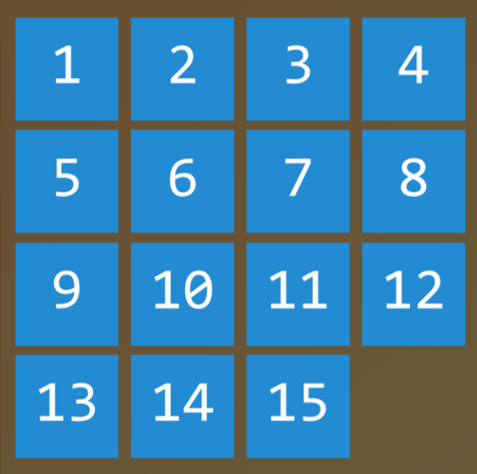
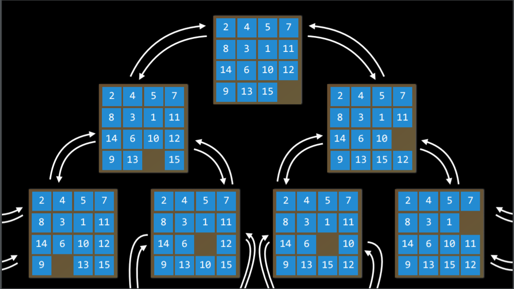
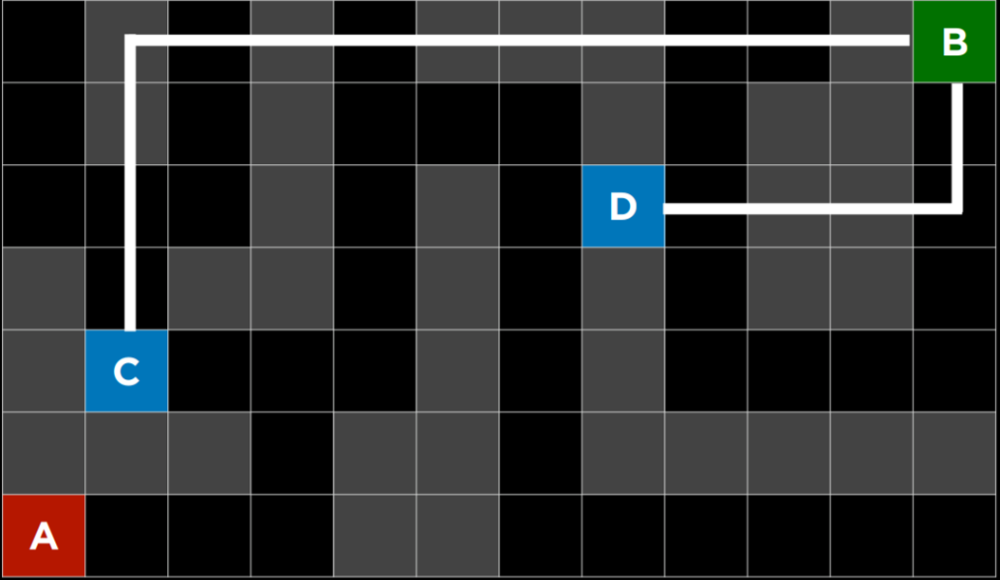
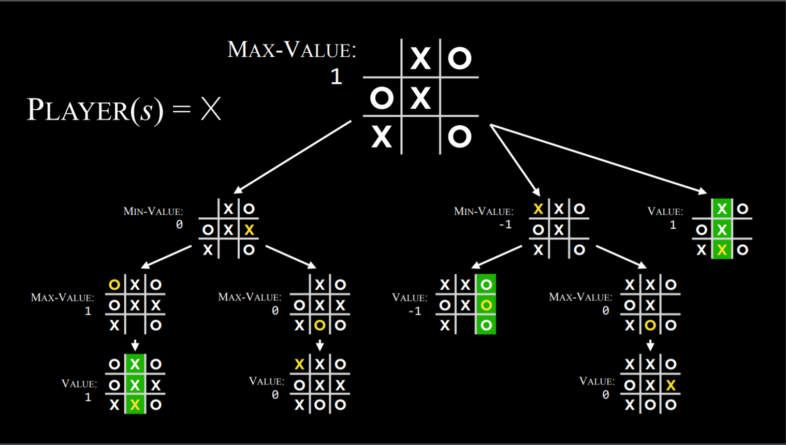
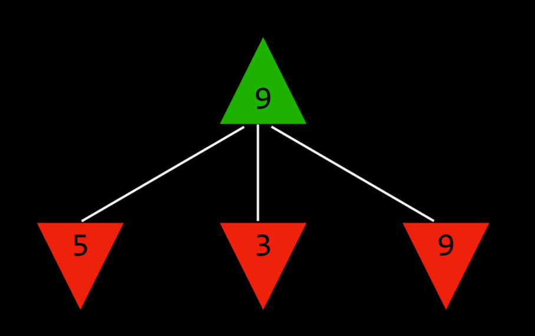
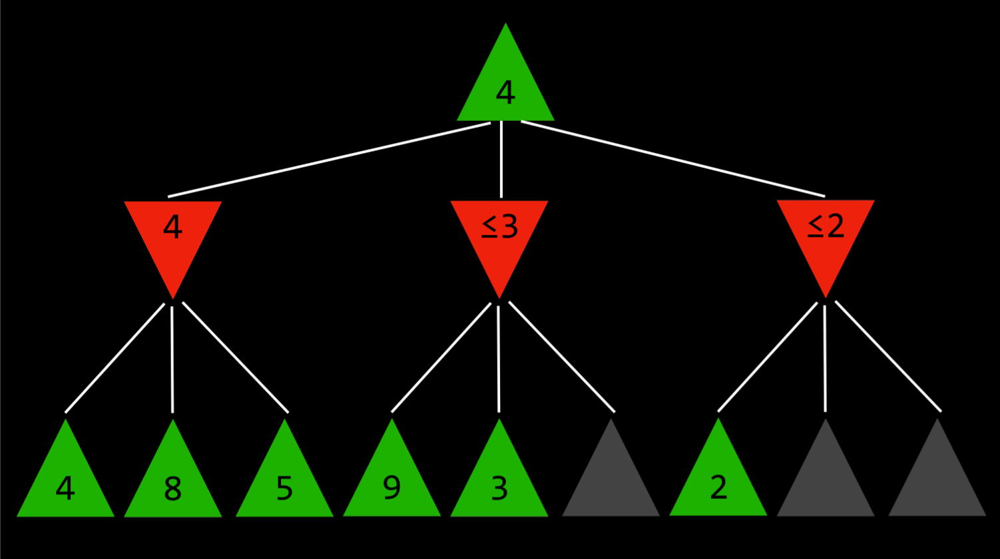

## Artificial Intelligence

Artificial Intelligence (AI) covers techniques that make computers appear intelligent. For instance, AI powers face recognition on social media, chess-playing champions, and voice assistants like Siri or Alexa.

This course explores core ideas behind AI:

0. **Search** – Finding solutions, such as a GPS finding routes or a game AI choosing moves.
1. **Knowledge** – Representing information and reasoning from it.
2. **Uncertainty** – Using probability to handle unpredictable events.
3. **Optimization** – Finding not just any solution, but the best one.
4. **Learning** – Improving with data and experience (e.g., email spam filters).
5. **Neural Networks** – Brain-inspired models that solve tasks effectively.
6. **Language** – Understanding and generating human language.

---

## Search

Search problems involve an **agent** starting in an initial state and aiming for a goal state. A GPS app, for example, takes your current location and destination, then computes a path. Puzzles and mazes are also search problems.

* **Agent** – Acts within its environment (e.g., a car in a GPS app).
* **State** – A configuration of the agent (e.g., a puzzle board layout).
* **Initial State** – The starting point.
* **Actions** – Possible moves from a state.
* **Transition Model** – The result of applying an action to a state.
* **State Space** – All states reachable through actions.
* **Goal Test** – Checks if the current state is the goal.
* **Path Cost** – A numerical value of how expensive a path is.




---

## Solving Search Problems

* **Solution** – A sequence of actions from start to goal.

  * **Optimal Solution** – The solution with the lowest path cost.

Search uses **nodes**, which store:

* The state
* Parent node
* Action taken
* Path cost

Nodes don’t search; the **frontier** manages them. The search repeats:

1. If frontier is empty → no solution.
2. Remove a node.
3. If it’s the goal → return solution.
4. Otherwise → expand it, add results to frontier, and mark explored.

---

### Depth-First Search (DFS)

Uses a **stack** (last-in, first-out). Explores one path as deep as possible before backtracking.

* **Pros**: Can be very fast if it “guesses” right.
* **Cons**: May miss optimal solutions, or take very long.

```python
def remove(self):
    if self.empty():
        raise Exception("empty frontier")
    node = self.frontier[-1]
    self.frontier = self.frontier[:-1]
    return node
```

---

### Breadth-First Search (BFS)

Uses a **queue** (first-in, first-out). Explores one step in all directions before going deeper.

* **Pros**: Always finds the optimal solution.
* **Cons**: Usually slower.

```python
def remove(self):
    if self.empty():
        raise Exception("empty frontier")
    node = self.frontier[0]
    self.frontier = self.frontier[1:]
    return node
```

📺 [DFS vs BFS cartoon](https://www.youtube.com/watch?v=2wM6_PuBIxY)

---

### Greedy Best-First Search

An **informed** search that expands the node closest to the goal using a heuristic *h(n)* (e.g., Manhattan distance in a maze). Fast but can be misled by poor heuristics.



---

### A\* Search

Improves greedy best-first by combining:

* *g(n)* = cost so far
* *h(n)* = estimated cost to goal

To be optimal, *h(n)* must be:

1. **Admissible** – never overestimates.
2. **Consistent** – satisfies *h(n) ≤ h(n′) + c*.

---

### Adversarial Search

Used in games where opponents compete (e.g., tic-tac-toe).

#### Minimax

Simulates all possible plays:

* Maximizer tries for +1, minimizer for -1.
* Recursively evaluates future states until a terminal state is reached.

Pseudocode alternates between **Max-Value** and **Min-Value** functions, choosing the best move accordingly.




#### Alpha-Beta Pruning

Optimizes Minimax by skipping branches that cannot improve the outcome.



---

## Depth-Limited Minimax

Since games like chess have too many possibilities, Minimax is limited to a fixed depth. An **evaluation function** estimates the utility of non-terminal states (e.g., board position in chess). The better the evaluation function, the better the AI.

