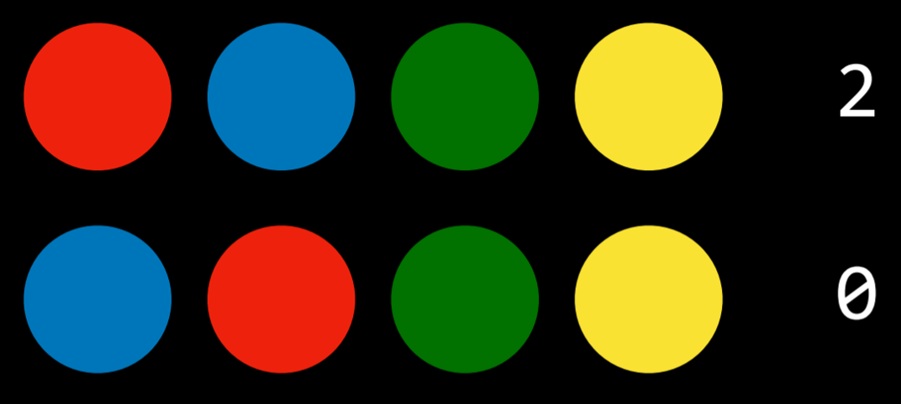
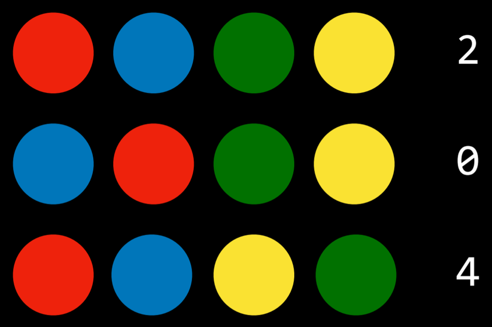
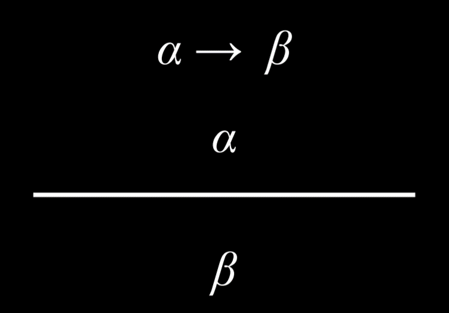
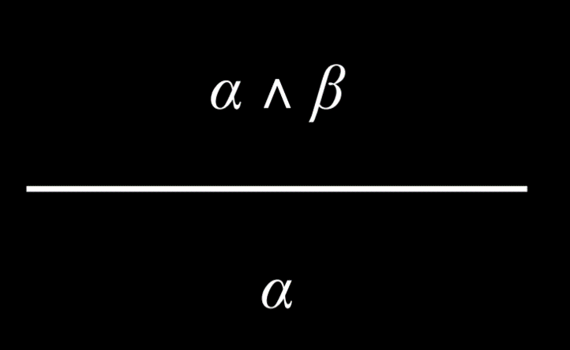
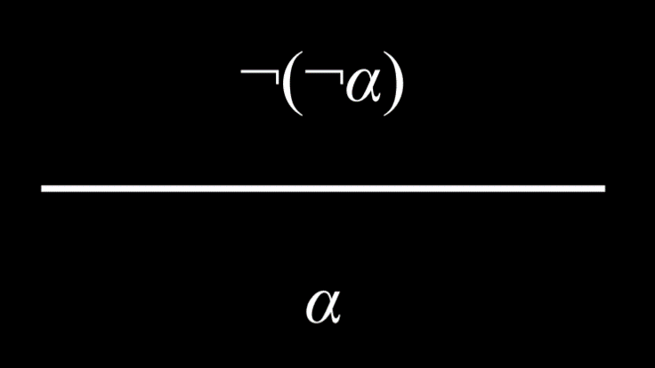
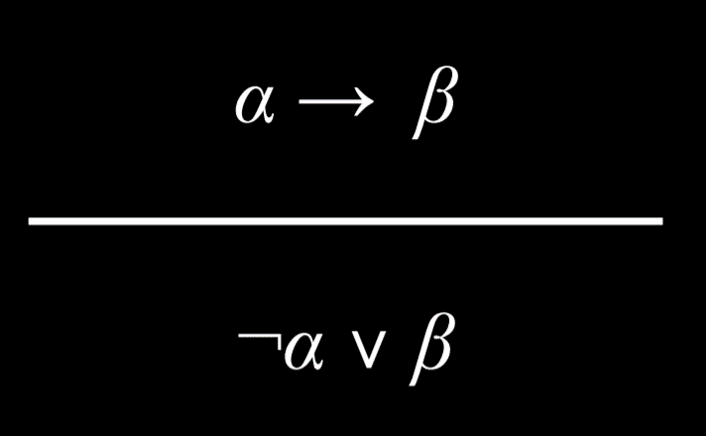
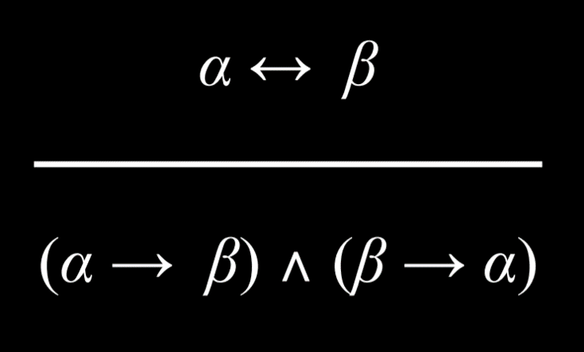
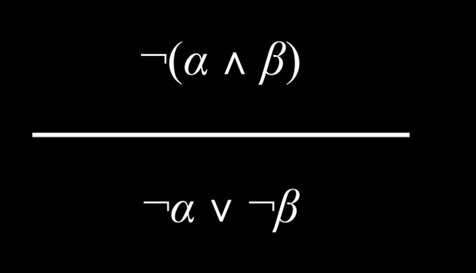
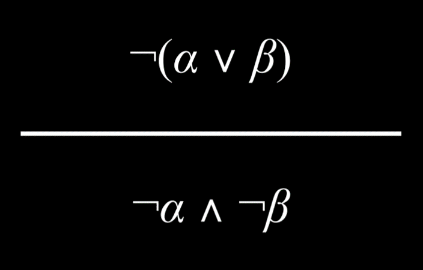

## Knowledge

Humans reason from knowledge to conclusions; AI can do the same.

### Knowledge-Based Agents

Agents that operate on internal representations of knowledge.

**Example (Harry Potter):**

1. If it didn’t rain, Harry visited Hagrid.
2. Harry visited Hagrid or Dumbledore, but not both.
3. Harry visited Dumbledore.
   → From these, we infer:
4. Harry did not visit Hagrid.
5. It rained today.

AI uses **logic** to reach new conclusions from facts.

---

## Propositional Logic

Based on propositions: statements that are **true or false**.

### Symbols

Propositional symbols: *P, Q, R*.

### Connectives
Not (¬) inverts truth.

| P     | ¬P    |
  | ---   | ---   |
  | false | true  |
  | true  | false |

And (∧) true if both true.

| P     | Q     | P ∧ Q |
  | ---   | ---   | ---   |
  | false | false | false |
  | false | true  | false |
  | true  | false | false |
  | true  | true  | true  |

Or (∨) true if at least one is true (inclusive by default).

| P     | Q     | P ∨ Q |
| ---   | ---   | ---   |
| false | false | false |
| false | true  | true  |
| true  | false | true  |
| true  | true  | true  |

Tips:
> Inclusive Or = “room OR lawn → dessert” (both works).
> Exclusive Or (XOR, ⊕) = “cookies OR ice cream” (not both).

* **Implication (→)** “If P, then Q.”

| P     | Q     | P → Q |
| ---   | ---   | ---   |
| false | false | true  |
| false | true  | true  |
| true  | false | false |
| true  | true  | true  |

* **Biconditional (↔)** “P iff Q.”

| P     | Q     | P ↔ Q |
| ---   | ---   | ---   |
| false | false | true  |
| false | true  | false |
| true  | false | false |
| true  | true  | true  |


---

### Model

Assignment of truth values.
Example: {P=True, Q=False}. With *n* propositions → 2ⁿ models.

### Knowledge Base (KB)

A set of sentences in logic describing the world.

### Entailment (⊨)

If α ⊨ β, then whenever α is true, β is also true.
E.g., “Tuesday in January ⊨ January.”

---

## Inference

Process of deriving new sentences.
E.g., in Harry Potter, (1,2,3) ⇒ (4,5).

### Model Checking Algorithm

To test if KB ⊨ α:

1. Enumerate all models.
2. Keep only models where KB is true.
3. If α is true in all those models → entailment holds.

Example:
P = Tuesday, Q = raining, R = Harry runs.
KB = (P ∧ ¬Q) → R, plus P, plus ¬Q.
→ Only models where KB = true also make R true.
So KB ⊨ R.

---

### Python Example (Harry Potter KB)

```python
rain = Symbol("rain")
hagrid = Symbol("hagrid")
dumbledore = Symbol("dumbledore")

knowledge = And(
    Implication(Not(rain), hagrid),
    Or(hagrid, dumbledore),
    Not(And(hagrid, dumbledore)),
    dumbledore
)
```

Model checking iterates over truth assignments to see if query holds in all KB-true models.

---

## Knowledge Engineering

Designing how to represent logic in AI.

### Example: Clue Game

Rules: one murderer, one weapon, one room.
Add clues to KB (cards seen, wrong guesses, etc.).
→ Deduce Scarlet with knife in library.

Python snippet:

```python
knowledge = And(
    Or(mustard, plum, scarlet),
    Or(ballroom, kitchen, library),
    Or(knife, revolver, wrench),
    Not(mustard), Not(kitchen), Not(revolver),
    Or(Not(scarlet), Not(library), Not(wrench)),
    Not(plum), Not(ballroom)
)
```

### Other Puzzles

* **House assignment riddle** (Minerva ↔ Gryffindor, etc.).
* **Mastermind game** → represent colors & positions in logic.





---

## Inference Rules

Faster than model checking → derive conclusions directly.

* **Modus Ponens**: (P→Q, P) ⇒ Q
  

* **And Elimination**: (P∧Q) ⇒ P
  

* **Double Negation**: ¬¬P ⇒ P
  

* **Implication Elimination**: P→Q ⇔ ¬P∨Q
  

* **Biconditional Elimination**: P↔Q ⇔ (P→Q)∧(Q→P)
  

* **De Morgan’s Law**: ¬(P∧Q) ⇔ (¬P∨¬Q), and vice versa.
  
  

---
