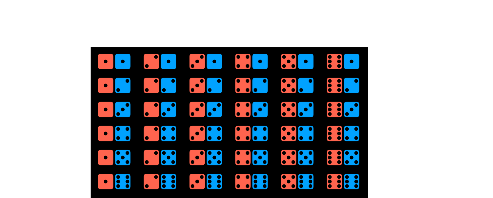
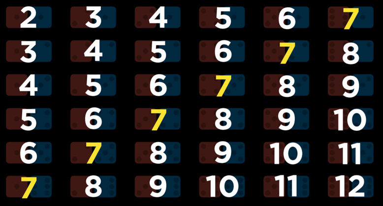
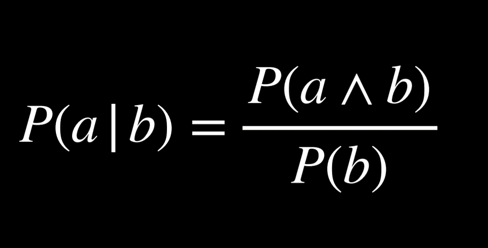
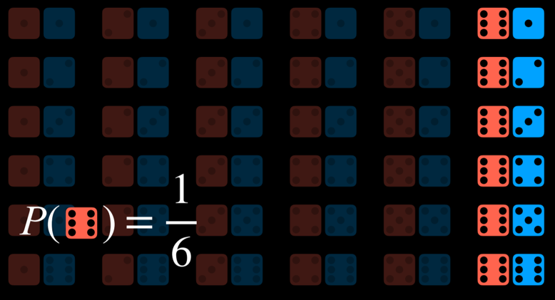
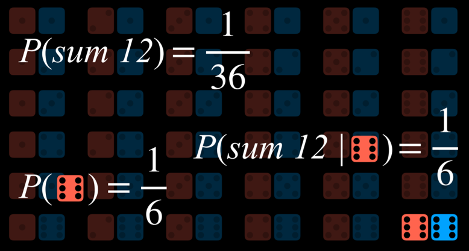
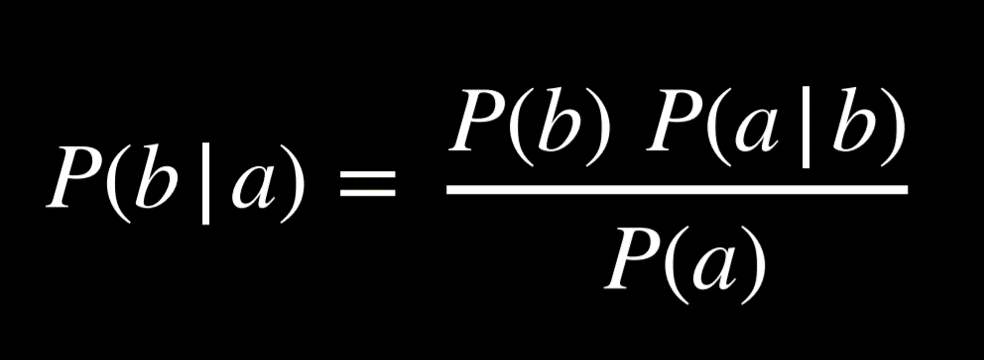
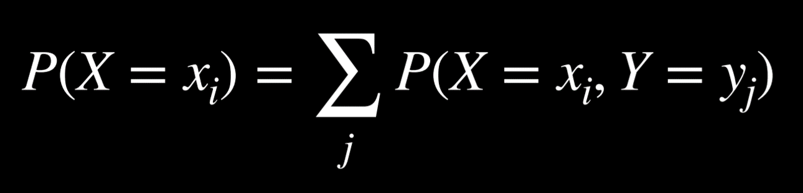
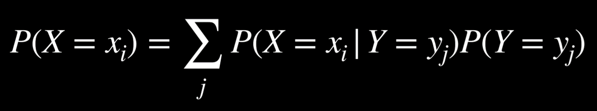
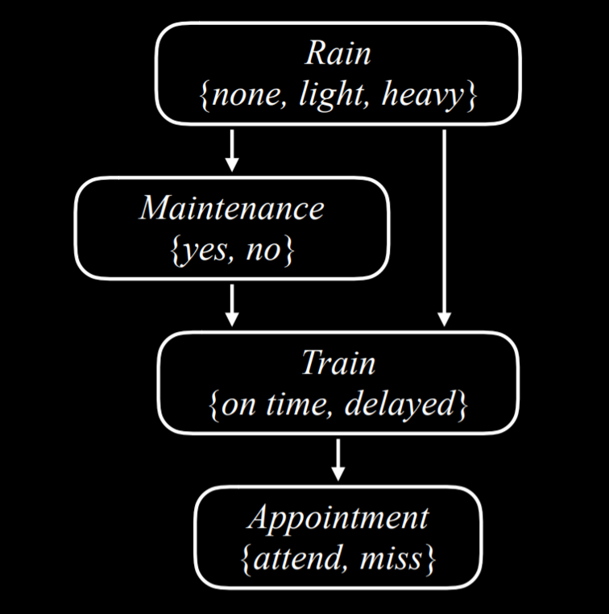
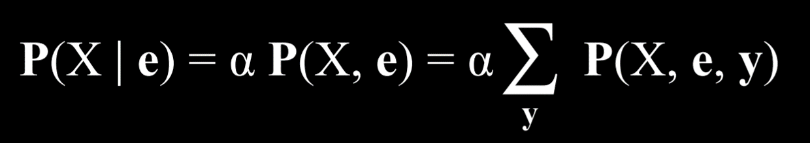

## Uncertainty

AI often has only **partial knowledge**. We still want optimal decisions under uncertainty.
Example: predicting weather → not 100% certain, but better than chance.

---

## Probability

* **Possible Worlds (ω)**: each possible outcome. Example: roll of a die → 6 worlds.
* **Axioms**:

  * 0 ≤ P(ω) ≤ 1
  * P(all worlds) = 1

Examples:

* Single die → P(R=any face) = 1/6
* Two dice → 36 worlds, unequal sums.




---

## Conditional Probability

P(a | b) = P(a ∧ b) / P(b)

Meaning: probability of *a* given *b*.

Examples:

* P(rain today | rain yesterday)
* P(disease | test result)
* P(sum=12 | one die = 6)





---

## Random Variables

Variables with possible values + probabilities.

* Roll = {1,…,6}
* Flight = {on time, delayed, canceled}

Distribution example:
P(Flight) = ⟨0.6, 0.3, 0.1⟩

* **Independence**: P(a ∧ b) = P(a)P(b)

  * Example: two dice are independent
  * Clouds & rain are dependent

---

## Bayes’ Rule

P(b | a) = P(a | b) P(b) / P(a)

Example:

* P(clouds | rain) = 0.8
* P(clouds) = 0.4
* P(rain) = 0.1
  → P(rain | clouds) = (0.1×0.8)/0.4 = 0.2

Useful for:

* Medical testing (P(test | disease) ⇒ P(disease | test))



---

## Joint Probability

Example: clouds & rain.

|          | R=rain | R=¬rain |
| -------- | ------ | ------- |
| C=cloud  | 0.08   | 0.32    |
| C=¬cloud | 0.02   | 0.58    |

* P(C ∧ R) = 0.08
* P(¬C ∧ ¬R) = 0.58

Conditional from joint:
P(C | R) = P(C∧R)/P(R) = α⟨0.08, 0.02⟩ → normalize → ⟨0.8, 0.2⟩

---

## Probability Rules

* **Negation**: P(¬a) = 1 − P(a)
* **Inclusion-Exclusion**: P(a ∨ b) = P(a)+P(b)−P(a∧b)

  * Example: ice cream 0.8, cookies 0.7 → need overlap correction
* **Marginalization**: P(a) = P(a∧b) + P(a∧¬b)
* **Conditioning**: P(a) = P(a|b)P(b) + P(a|¬b)P(¬b)




---

## Bayesian Networks

* Directed graphs.
* Nodes = random variables.
* Parent → child = dependency.
* Each node has P(X | Parents(X)).

Example: Rain → Maintenance → Train → Appointment.



Inference: compute P(Query | Evidence).

* Evidence = observed (e.g., Rain=light)
* Hidden = unobserved (e.g., Maintenance)
* Goal = distribution of query (e.g., Appointment).

---

## Inference by Enumeration

Formula:



Python (pomegranate):

```python
from pomegranate import *

rain = Node(DiscreteDistribution({
    "none": 0.7, "light": 0.2, "heavy": 0.1
}), "rain")

maintenance = Node(ConditionalProbabilityTable([
    ["none","yes",0.4],["none","no",0.6],
    ["light","yes",0.2],["light","no",0.8],
    ["heavy","yes",0.1],["heavy","no",0.9]
], [rain.distribution]), "maintenance")
```

…and similarly for `train` and `appointment`.

---

## Sampling (Approximate Inference)

Instead of exact enumeration:

* Sample variable values from distributions.
* Repeat → approximate probabilities.

Example: roll die 600 times → approximate uniform distribution.

Lecture example: sample Rain → sample Maintenance conditional on Rain → …

* P(Train=on time) ≈ (#samples with Train=on time)/(total samples)
* Conditional: P(Rain=light | Train=on time) ≈ ratio from filtered samples

Python sample generator:

```python
def generate_sample():
    sample, parents = {}, {}
    for state in model.states:
        if isinstance(state.distribution, ConditionalProbabilityTable):
            sample[state.name] = state.distribution.sample(parent_values=parents)
        else:
            sample[state.name] = state.distribution.sample()
        parents[state.distribution] = sample[state.name]
    return sample
```

