## Optimization

Optimization is about choosing the most effective option from a range of possible ones. We’ve already seen examples in algorithms like minimax, but now we’ll look at a broader toolkit for tackling optimization problems.

## Local Search

Local search works with a single candidate solution (a node) and improves it by exploring its nearby alternatives. Unlike systematic search methods (like maze solvers) that try to find a path to a specific goal, local search is more about directly finding a “good enough” solution, often without covering the entire search space.

For example: imagine four houses placed on a grid. We want to position two hospitals so that the total **Manhattan distance** (grid-based distance—up, down, left, right) from each house to the closest hospital is as small as possible.

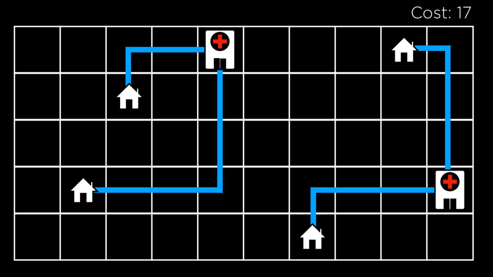

In the layout above, the overall distance (the “cost”) is **17**. Each different hospital arrangement represents a state in the search space.

We can think of this space as a “landscape,” where every state has a score (cost in this example):

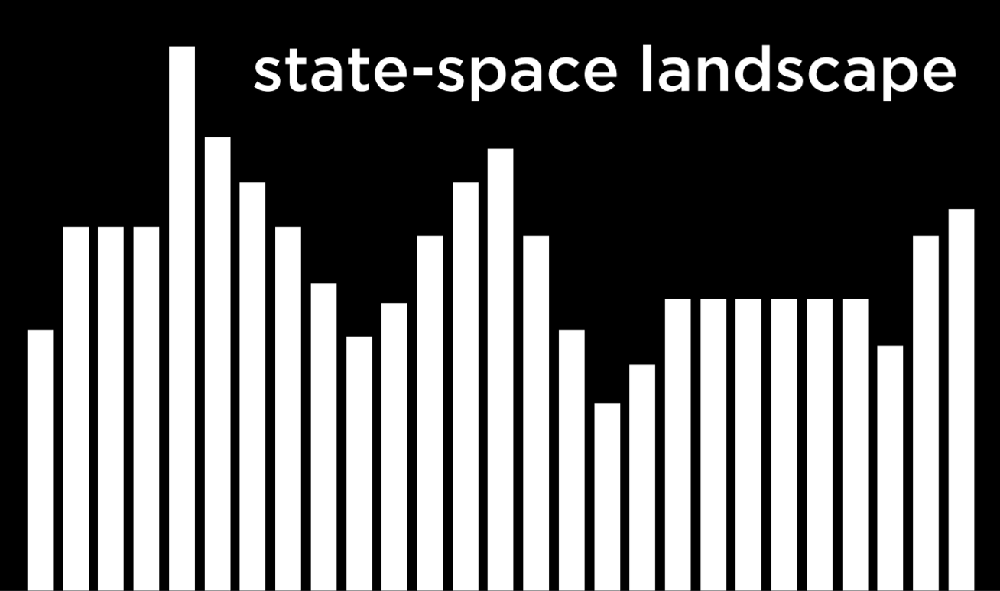

Important concepts:

* **Objective Function**: Measures how good a solution is (something we try to maximize).
* **Cost Function**: Measures how expensive or bad a solution is (something we try to minimize).
* **Current State**: The solution we’re currently evaluating.
* **Neighboring State**: A slightly modified version of the current state (e.g., moving a hospital one cell).

Local search differs from recursive algorithms like minimax because it focuses only on one state at a time, moving step by step.

## Hill Climbing

Hill climbing is a local search method that always moves to a neighbor if it’s an improvement. “Better” could mean a higher score (for objective functions) or a lower cost.

Pseudocode:

```
function Hill-Climb(problem):
    current = initial state
    repeat:
        neighbor = best neighbor of current
        if neighbor not better:
            return current
        current = neighbor
```

Starting from an initial state (sometimes chosen randomly), we repeatedly step to the best neighbor. The process stops when no better neighbor exists.

Applied to the hospital problem, the cost can drop from 17 to 11:

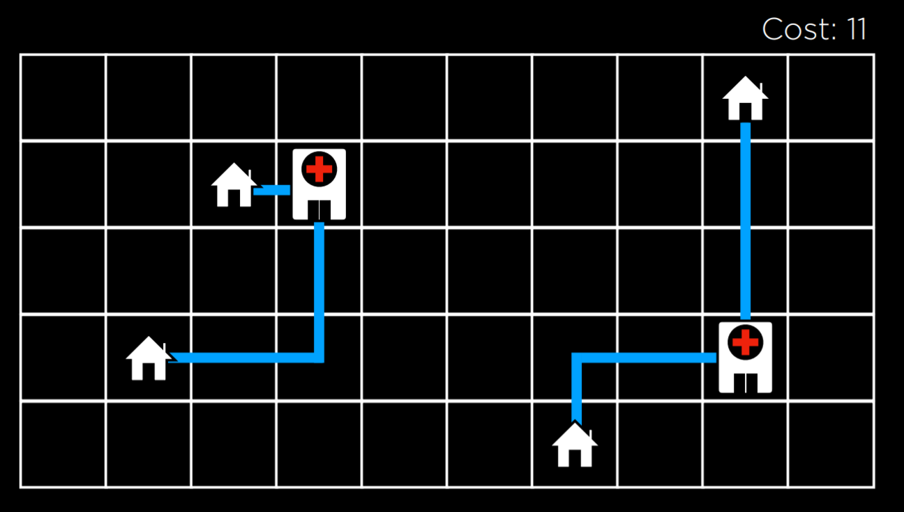

But this isn’t the global best (we could reach 9). Hill climbing often gets trapped in **local optima**.

### Local vs. Global Optima

* **Local Maximum**: Better than all its neighbors but not the best overall.
* **Global Maximum**: The best solution in the entire search space.
* **Local Minimum**: Lower than all neighbors but not the lowest overall.
* **Global Minimum**: The lowest cost possible.


Hill climbing’s main limitation is that it can get stuck in these local optima. Other problem cases:

* **Flat Optimum**: A plateau of equal-value states, surrounded by worse ones.
* **Shoulder**: A flat area with some neighbors better and others worse.

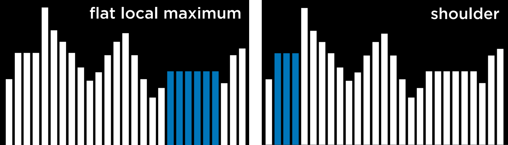

### Variations of Hill Climbing

To avoid getting stuck, there are modified versions:

* **Steepest-ascent**: Always take the single best neighbor (the basic version).
* **Stochastic**: Pick randomly from the better neighbors.
* **First-choice**: Take the first improving neighbor found.
* **Random-restart**: Run the algorithm multiple times from random starting points, keep the best outcome.
* **Local Beam Search**: Track the top *k* candidates at once, rather than just one.

These strategies still can’t guarantee the global optimum but usually produce good solutions quickly.

## Simulated Annealing

Simulated annealing allows occasional moves to worse neighbors in order to escape local optima. The name comes from the process of slowly cooling metals to improve their structure.

It begins with a high “temperature,” meaning random moves are often accepted. Over time, the temperature decreases, making the search more focused.

Pseudocode:

```
function Simulated-Annealing(problem, max):
    current = initial state
    for t = 1 to max:
        T = Temperature(t)   # decreases over time
        neighbor = random neighbor
        ΔE = value(neighbor) - value(current)
        if ΔE > 0:
            current = neighbor
        else:
            with probability e^(ΔE/T), set current = neighbor
    return current
```

At the start, the algorithm explores freely; later, it becomes more conservative. The chance of accepting a worse solution depends on how much worse it is (ΔE) and the current temperature (T).

A classic application is the **Traveling Salesman Problem (TSP)**: finding the shortest loop visiting all cities once. Since there are *n!* possible tours, simulated annealing can provide a near-optimal route efficiently.

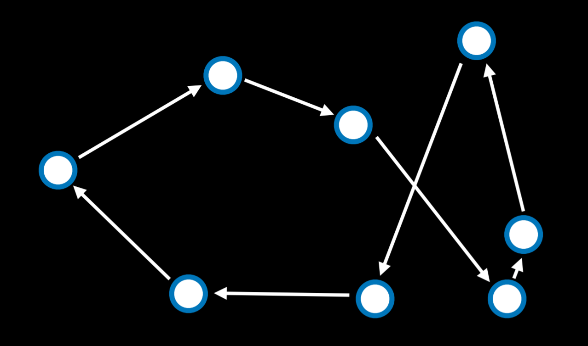

## Linear Programming

Linear programming (LP) is about optimizing a linear objective function while obeying linear constraints.

Elements of an LP problem:

* **Objective (Cost) Function**: Something like minimize `c₁x₁ + c₂x₂ + … + cₙxₙ`.
* **Constraints**: Linear inequalities or equalities.
* **Bounds**: Restrictions like non-negativity.

Example:

* Machine X₁ costs \$50/hour, X₂ costs \$80/hour. Goal: minimize `50x₁ + 80x₂`.
* Labor: X₁ needs 5 units/hour, X₂ needs 2. Limit: `5x₁ + 2x₂ ≤ 20`.
* Production: X₁ makes 10 units/hour, X₂ makes 12. Requirement: `10x₁ + 12x₂ ≥ 90`.

In code (Python with `scipy.optimize.linprog`):

```python
import scipy.optimize

# Objective: Minimize 50x1 + 80x2
# Constraints: 5x1 + 2x2 <= 20, and 10x1 + 12x2 >= 90
result = scipy.optimize.linprog(
    [50, 80],
    A_ub=[[5, 2], [-10, -12]],
    b_ub=[20, -90]
)

if result.success:
    print(f"X1: {round(result.x[0], 2)} hours")
    print(f"X2: {round(result.x[1], 2)} hours")
else:
    print("No solution")
```

## Constraint Satisfaction

A **Constraint Satisfaction Problem (CSP)** assigns values to variables under a set of constraints.

Setup:

* **Variables**: x₁, x₂, …, xₙ
* **Domains**: D₁, D₂, …, Dₙ
* **Constraints**: Restrictions between variables

Example: exam scheduling. Each course is a variable, days are the domain, and constraints prevent students from having overlapping exams.

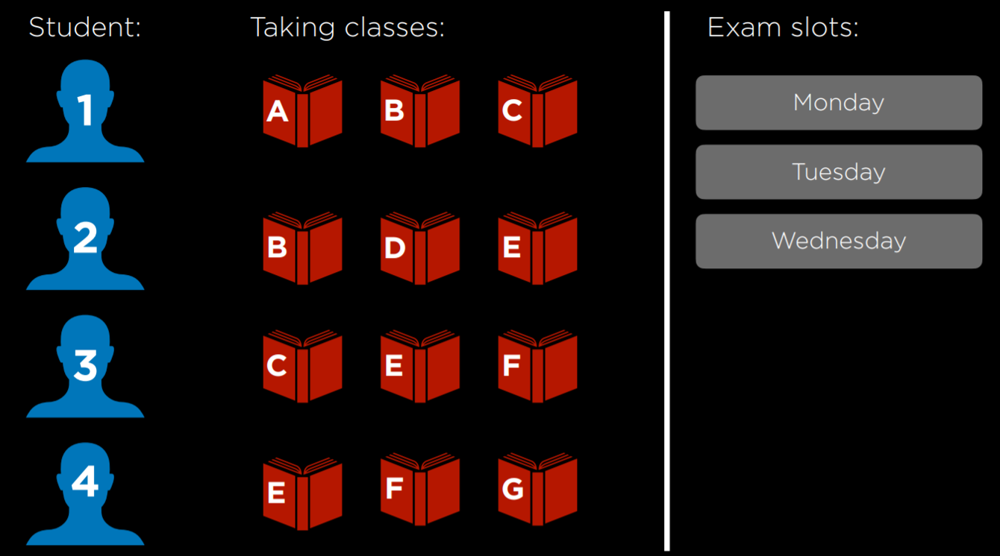
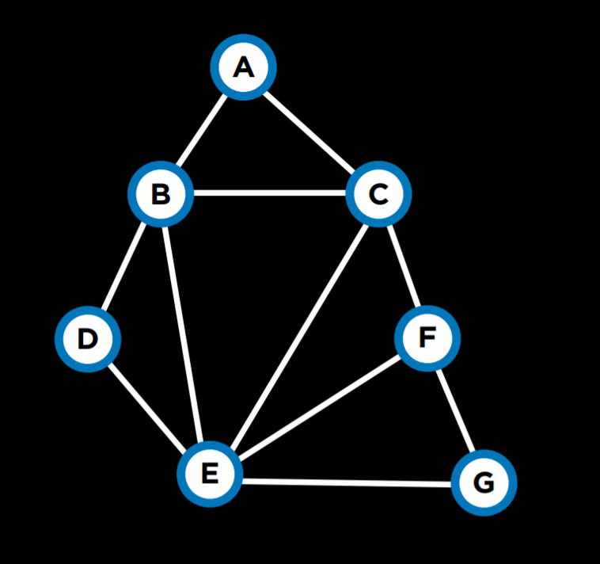

Types of constraints:

* **Hard**: Must be followed.
* **Soft**: Preferable but not required.
* **Unary**: One variable (e.g., “A ≠ Monday”).
* **Binary**: Between two variables (e.g., “A ≠ B”).

## Node Consistency

A variable is node-consistent if all remaining domain values satisfy its unary constraints. Example: if A can’t be Monday, then remove Monday from its domain.

## Arc Consistency

Arc-consistency ensures that for every value of variable X, there exists some compatible value in Y (for their shared constraint). Otherwise, X’s value is pruned.

Revise function:

```
function Revise(csp, X, Y):
    revised = false
    for x in X.domain:
        if no y in Y.domain satisfies (X,Y) constraint:
            remove x from X.domain
            revised = true
    return revised
```

**AC-3 algorithm** enforces arc-consistency throughout the CSP:

```
function AC-3(csp):
    queue = all arcs
    while queue not empty:
        (X, Y) = Dequeue(queue)
        if Revise(csp, X, Y):
            if X.domain empty: return false
            for each Z in X.neighbors except Y:
                Enqueue(queue, (Z, X))
    return true
```

AC-3 won’t necessarily solve the CSP outright, but it greatly simplifies the problem.

## CSPs as Search Problems

We can frame CSPs like search:

* Start: no assignments.
* Actions: assign a value.
* Transition: add assignment.
* Goal: all variables assigned, constraints satisfied.

Backtracking is a standard method for this.

## Backtracking Search

Backtracking tries assignments recursively, undoing (backtracking) when a constraint is violated.

```
function Backtrack(assignment, csp):
    if assignment complete: return assignment
    var = Select-Unassigned-Var(assignment, csp)
    for value in Domain-Values(var, assignment, csp):
        if value consistent:
            add {var = value} to assignment
            result = Backtrack(assignment, csp)
            if result ≠ failure: return result
            remove {var = value} from assignment
    return failure
```

Example:

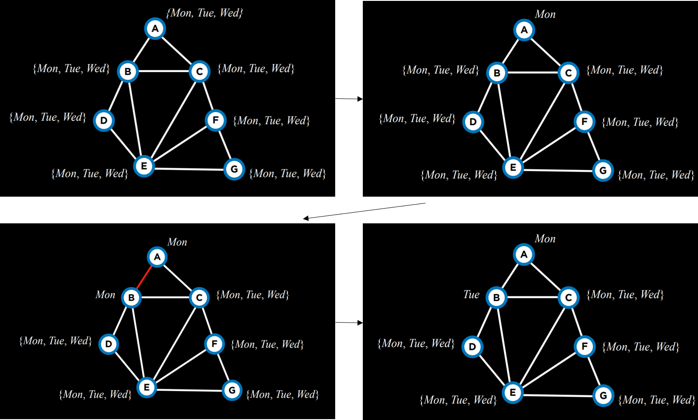

### Inference with Arc-Consistency

We can combine backtracking with inference (like AC-3) to prune domains after each assignment.

```
function Backtrack(assignment, csp):
    if assignment complete: return assignment
    var = Select-Unassigned-Var(assignment, csp)
    for value in Domain-Values(var, assignment, csp):
        if value consistent:
            add {var = value} to assignment
            inferences = Inference(assignment, csp)  # e.g., AC-3
            if inferences ≠ failure:
                add inferences to assignment
            result = Backtrack(assignment, csp)
            if result ≠ failure: return result
            remove {var = value} and inferences from assignment
    return failure
```

### Heuristics for Efficiency

* **MRV (Minimum Remaining Values)**: Pick the variable with the fewest legal values left. Helps detect dead ends early.

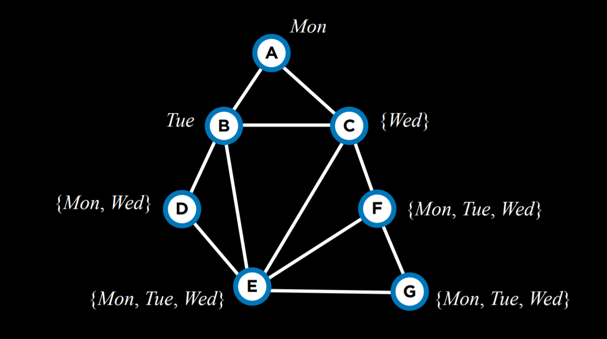

* **Degree Heuristic**: Choose the variable with the most constraints on others.

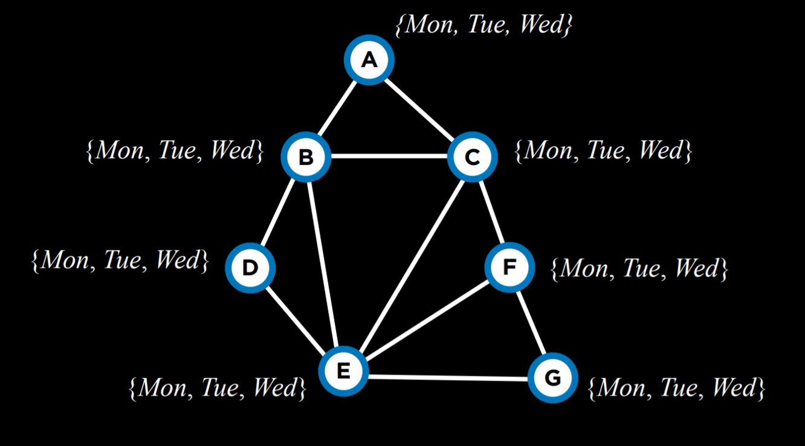

* **Least Constraining Value**: Pick the value that eliminates the fewest choices for neighbors.

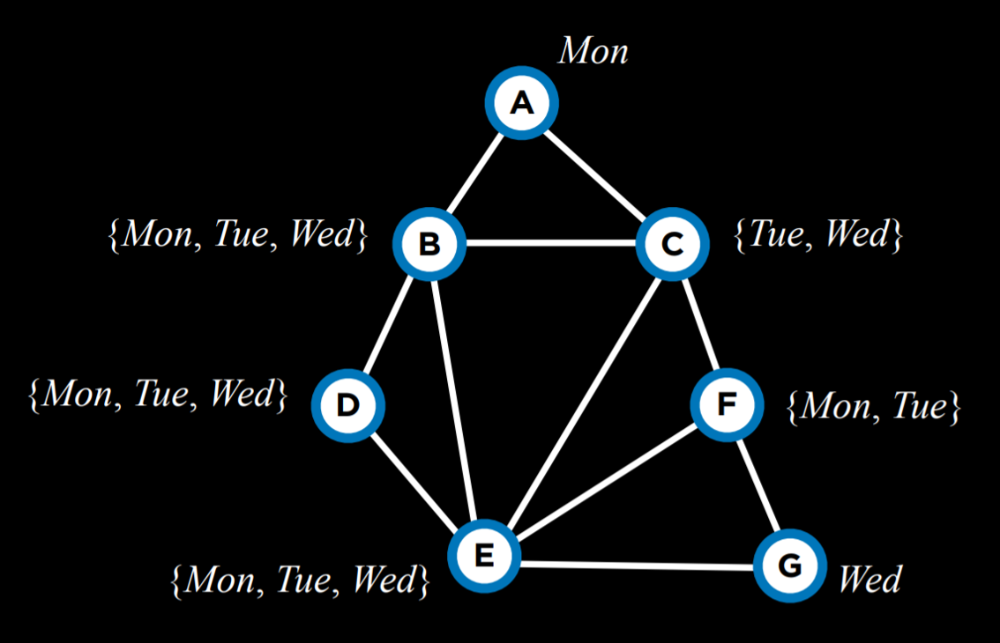


