## Machine Learning

Machine learning shifts from giving a computer explicit step-by-step instructions to instead providing it with data. From that data, the computer learns patterns and develops the ability to perform tasks on its own.

## Supervised Learning

Supervised learning refers to training a model using labeled data: inputs paired with correct outputs. The model’s task is to learn a function that maps inputs to outputs.

A common supervised learning task is **classification**. In classification, the goal is to predict a discrete label. For instance, given humidity and air pressure for a day (inputs), a program may predict whether it will rain (output). The model learns by training on a dataset where many days already have the humidity, pressure, and “rain/no rain” outcomes recorded.

Formally, nature has some unknown function *f*(humidity, pressure) → {Rain, No Rain}. We cannot directly observe *f*, but we want to build a function *h*(humidity, pressure) that closely mimics it. A visualization would place days on a two-dimensional graph (humidity vs. pressure), marking rainy days blue and non-rainy days red. For a new day (white dot), the model must infer the correct label.

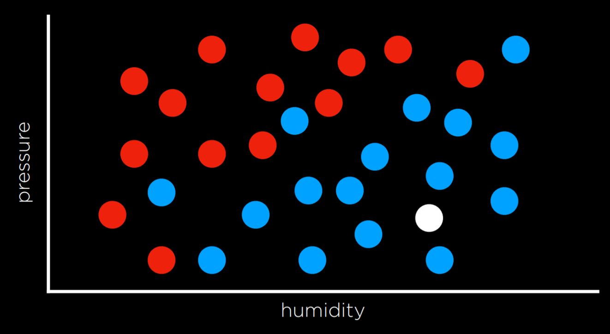

## Nearest-Neighbor Classification

One simple approach is to label a new point based on the label of the closest known point. For example, if the nearest dot to the white point is blue, we predict “Rain.”

This can sometimes mislead. Consider the case below:

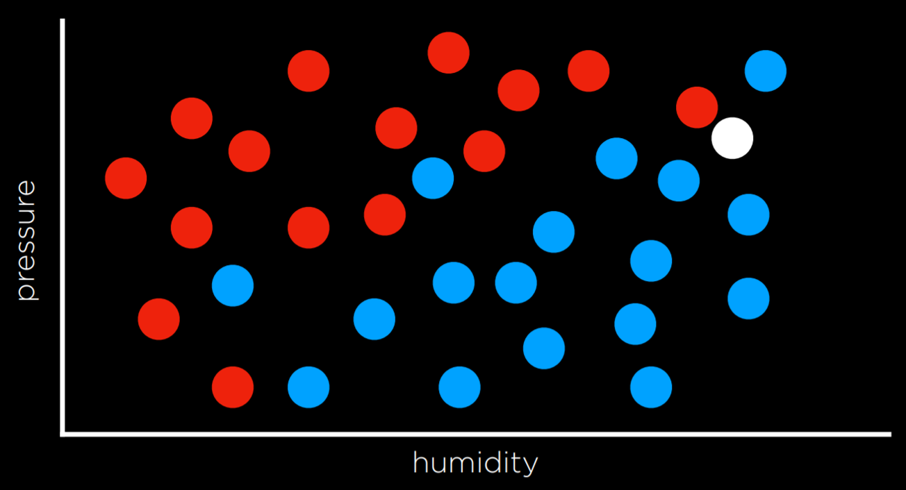

Here, the nearest observation to the white dot is red, so a naive nearest-neighbor method predicts “No Rain.” But notice that most nearby points are blue, suggesting “Rain” may actually be the better guess.

To fix this, we can use **k-nearest neighbors (k-NN)**. Instead of looking at just one neighbor, we look at the *k* closest ones and assign the label that occurs most often. If *k = 3* in the example, the white dot would be classified as blue, which better reflects the surrounding distribution.

The drawback is efficiency: with many data points, comparing against every point becomes expensive. Techniques like spatial trees (e.g., KD-trees) help make neighbor lookups faster.

## Perceptron Learning

Another method is to find a **decision boundary** separating the classes rather than relying on neighbors. In two dimensions, this is simply a line. New inputs are classified depending on which side of the line they fall.

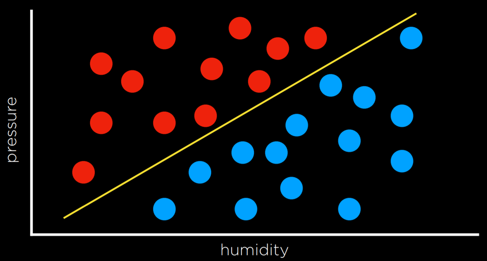

Of course, data rarely divides perfectly. Instead, we try to find a line that does the best job overall, even if some errors occur.

Suppose the inputs are:

* *x₁* = Humidity
* *x₂* = Pressure

We want to learn a hypothesis *h(x₁, x₂)*. The perceptron uses a weighted sum:

* Predict “Rain” if w₀ + w₁x₁ + w₂x₂ ≥ 0
* Otherwise predict “No Rain.”

This can be expressed using a **weight vector** w = (w₀, w₁, w₂) and an **input vector** x = (1, x₁, x₂). Their dot product gives the decision function.

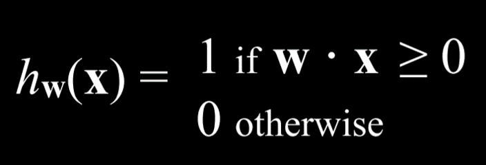

The model adjusts weights using the **perceptron learning rule**:

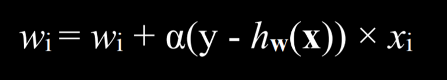

* If the prediction matches reality, no update occurs.
* If it underestimates (predicts No Rain when it actually rained), weights are nudged upward.
* If it overestimates (predicts Rain when it didn’t), weights are nudged downward.

The adjustment strength depends on α, the learning rate.

Initially, this produces a **hard threshold** function, jumping directly between 0 and 1.

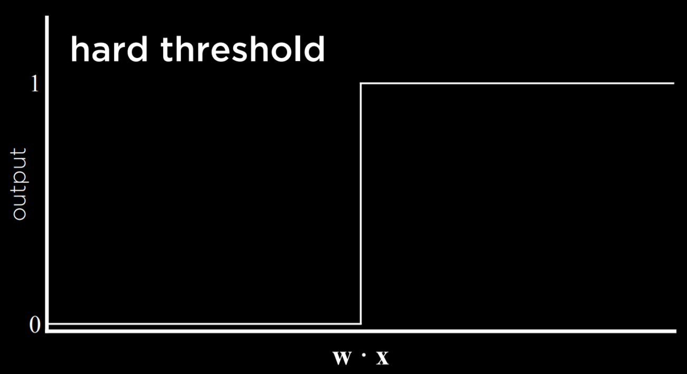

To allow uncertainty, we can replace the step with a **logistic (sigmoid) function**, which smoothly outputs values between 0 and 1, representing confidence in the prediction.

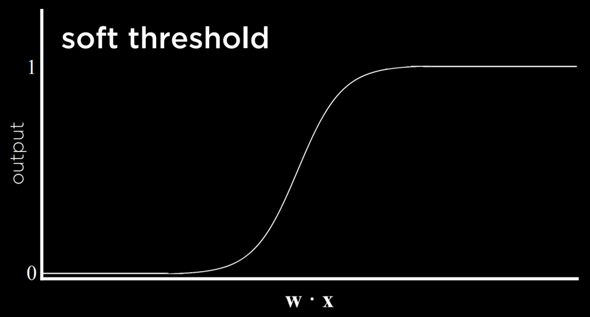

## Support Vector Machines

Support Vector Machines (SVMs) also construct decision boundaries but aim to find the boundary with the **maximum margin**: the one farthest from the closest data points on either side.

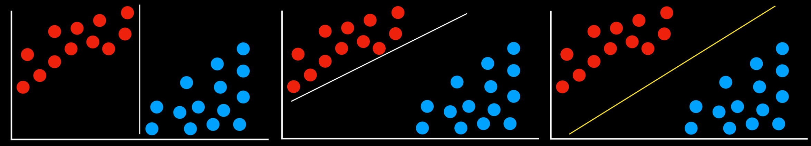

Among all valid boundaries, the one with the largest margin is preferred because it is less sensitive to small changes in data.

SVMs can also handle more complex boundaries, including non-linear separations by projecting the data into higher-dimensional spaces.

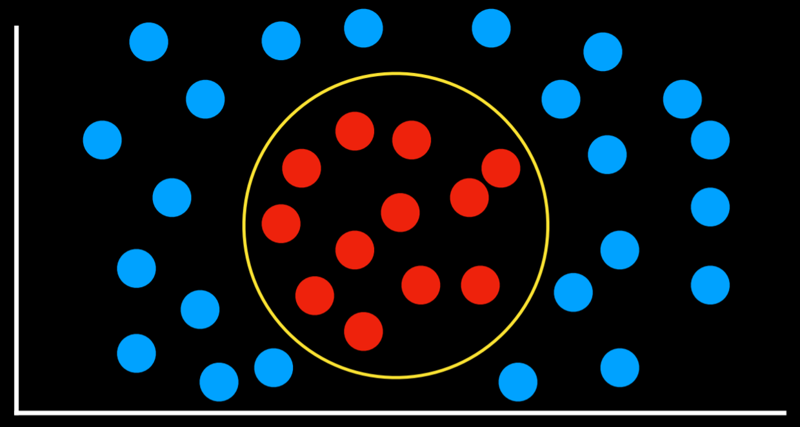

## Regression

Where classification predicts discrete labels, **regression** predicts continuous values.

Example: A company may model the relationship between advertising spending and revenue. With historical data (spending → income), the model learns a function *h(advertising)* to estimate future income.

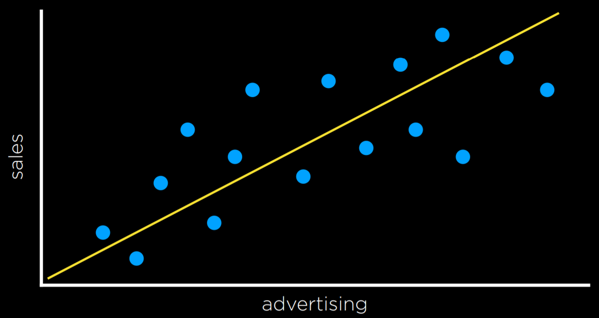

## Loss Functions

A **loss function** quantifies how wrong predictions are.

For classification, the **0-1 loss** assigns:

* 0 if prediction is correct
* 1 if incorrect

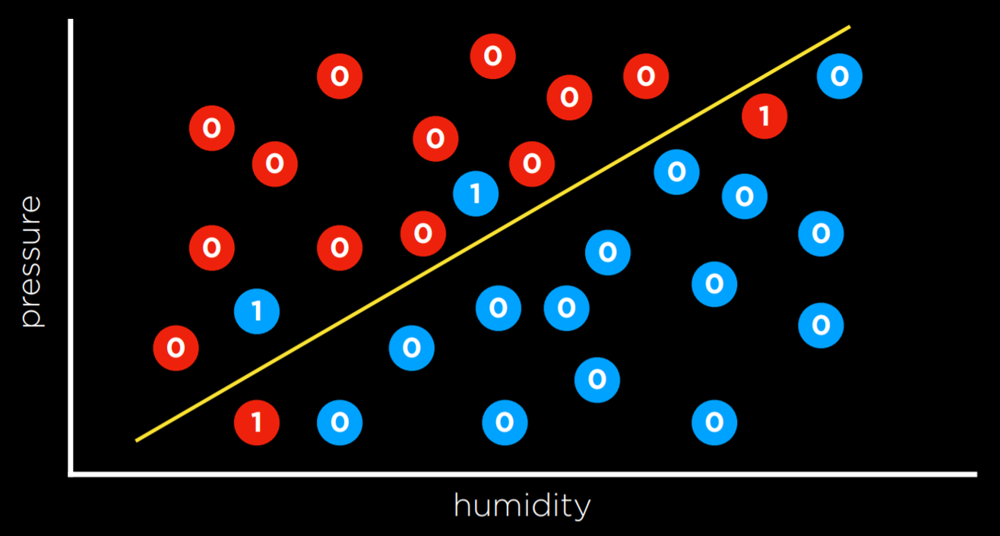

For regression, we often use:

* L₁ loss: |actual – predicted|
* L₂ loss: (actual – predicted)²

L₂ penalizes larger errors more strongly.

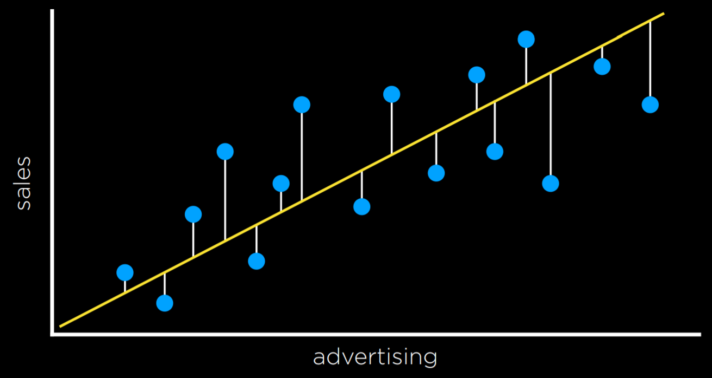

## Overfitting

A model that is too tightly fitted to training data may fail to generalize.

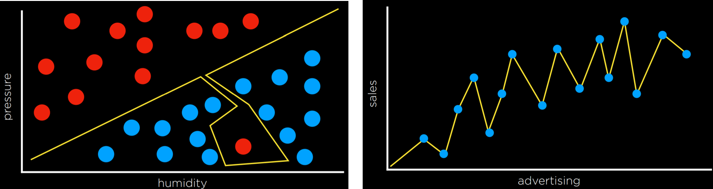

Even if it classifies training examples perfectly, it may misclassify new points.

## Regularization

To combat overfitting, we penalize complexity:

cost(h) = loss(h) + λ·complexity(h)

Larger λ increases the preference for simpler models.

### Cross-Validation

* **Holdout validation**: split data into training and testing sets.
* **k-fold cross-validation**: divide data into k subsets, train k times leaving one out each time, then average results.

## scikit-learn

In Python, the **scikit-learn** library provides easy access to ML algorithms.

Example: Classifying counterfeit banknotes.

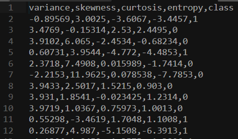

```python
import csv, random
from sklearn import svm
from sklearn.linear_model import Perceptron
from sklearn.naive_bayes import GaussianNB
from sklearn.neighbors import KNeighborsClassifier

# Choose a model
# model = KNeighborsClassifier(n_neighbors=1)
# model = svm.SVC()
model = Perceptron()
```

Training and testing are handled with just a few lines of code. The same dataset can be tried with different models simply by swapping out the classifier.

## Reinforcement Learning

Reinforcement learning (RL) differs from supervised learning: the model learns by acting and receiving **rewards** (positive or negative).

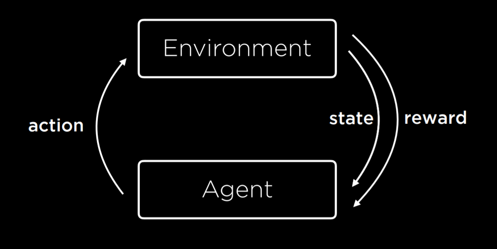

The agent interacts with the environment, takes actions, and adapts based on feedback.

## Markov Decision Processes

RL can be described as a **Markov Decision Process (MDP)**:

* States (S)
* Actions (Actions(S))
* Transition model (P(s’ | s, a))
* Reward function (R(s, a, s’))

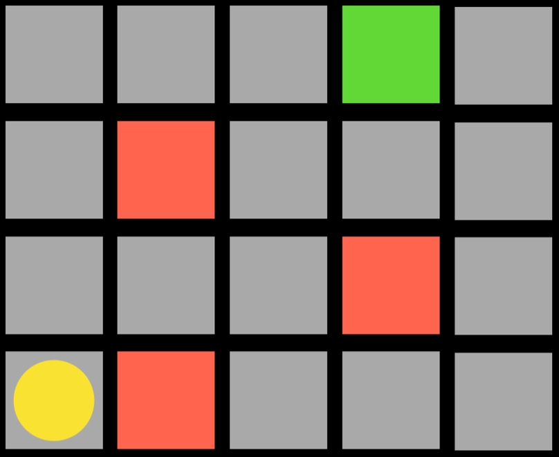

The agent explores and learns which actions yield better outcomes.

## Q-Learning

Q-Learning maintains a table of values ***Q(s, a)*** estimating the usefulness of taking action *a* in state *s*.

Initially, all values are zero. Updates occur as the agent acts:

***Q(s, a) ← Q(s, a) + α\[(r + γ max Q(s’, a’)) – Q(s, a)]***

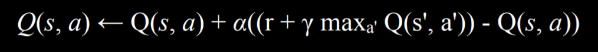

This balances old knowledge with new experience.

The **ε-greedy strategy** mixes exploration and exploitation:

* With probability (1–ε), pick the best action.
* With probability ε, pick a random action.

Over time, this allows discovery of better strategies.

## Unsupervised Learning

In unsupervised learning, data lack labels. The algorithm’s task is to find structure in the input.

### Clustering

**Clustering** groups similar data points. Applications include genetics (finding similar genes) and computer vision (segmenting images).

## k-means Clustering

The **k-means** algorithm partitions data into *k* clusters.

1. Randomly choose *k* initial centers.
2. Assign each point to the nearest center.
3. Recompute centers as the average of assigned points.
4. Repeat until cluster assignments stabilize.

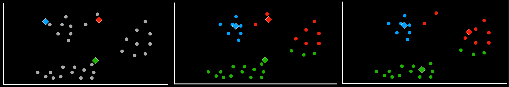


