## Neural Networks

Neural networks are inspired by biology. In the brain, neurons fire when input signals cross a threshold, passing signals onward.

An **Artificial Neural Network (ANN)** models this process: it’s a mathematical function mapping inputs to outputs. Each “neuron” (unit) receives inputs, multiplies them by weights, adds a bias, and passes the result through an **activation function**. The network learns weights from data during training.

---

## Activation Functions

To decide outputs, we apply an activation function:

* **Step function**: outputs 0 below threshold, 1 above.
  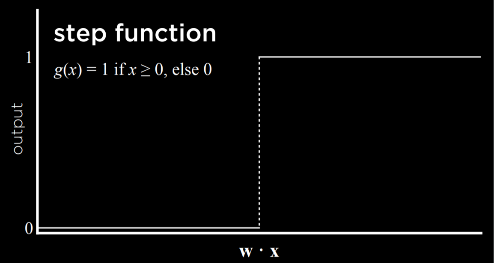

* **Logistic (sigmoid)**: outputs values between 0 and 1, showing confidence.
  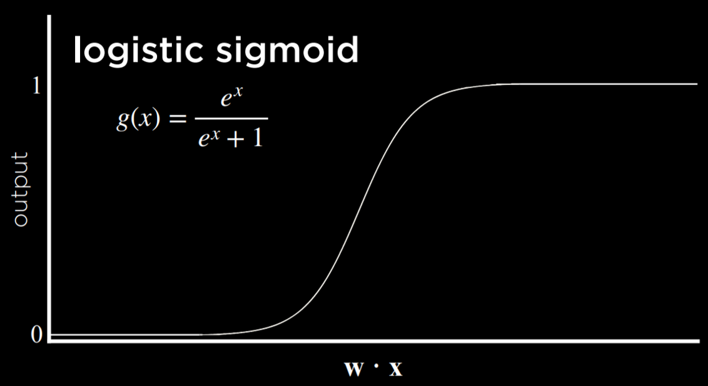

* **ReLU**: passes positive values, outputs 0 for negatives.
  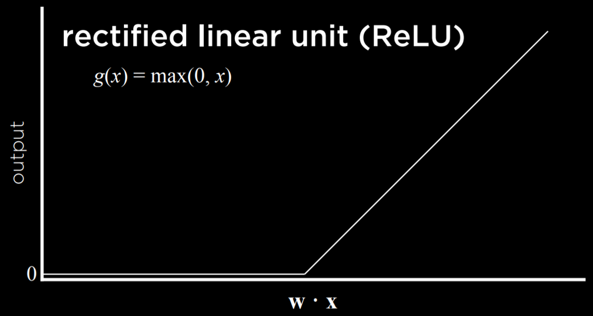

---

## Neural Network Structure

A simple network connects inputs to outputs via weighted edges.

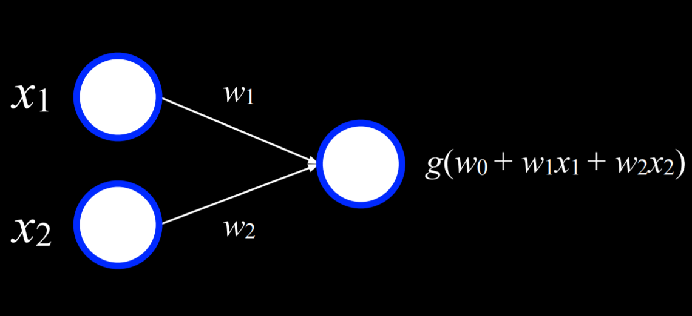

Example: the **Or** function. Inputs *x₁* and *x₂* connect to an output node. With weights and bias set appropriately, the output matches the OR truth table.

| x | y | f(x, y) |
| - | - | ------- |
| 0 | 0 | 0       |
| 0 | 1 | 1       |
| 1 | 0 | 1       |
| 1 | 1 | 1       |

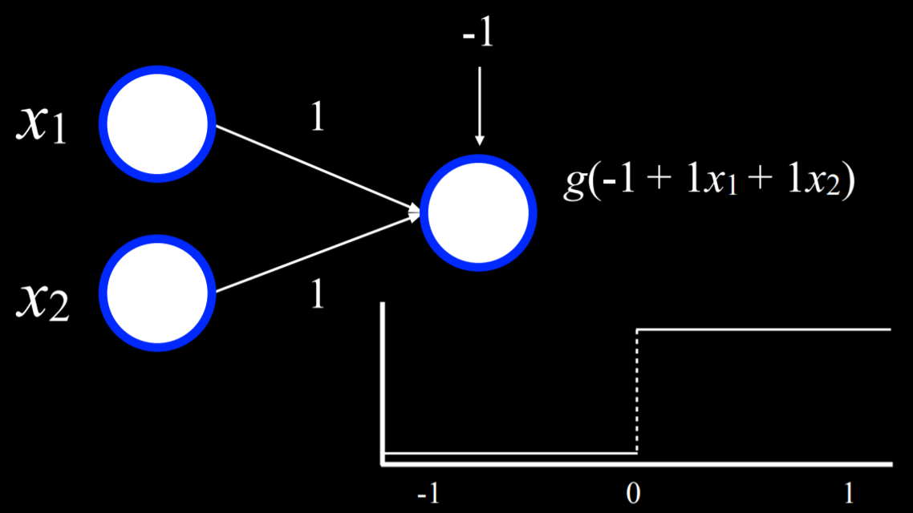

Similar setups can model **And**, weather prediction, or revenue forecasting. Scaling up just means adding more inputs and weights.

---

## Gradient Descent

Training adjusts weights to minimize loss:

1. Start with random weights.
2. Compute gradient of loss.
3. Update weights in the direction that reduces error.

* **Stochastic Gradient Descent (SGD)**: update with one random data point (fast but noisy).
* **Mini-Batch Gradient Descent**: update with small random batches (balanced).

This allows networks to output probabilities over multiple outcomes, e.g., different weather conditions.

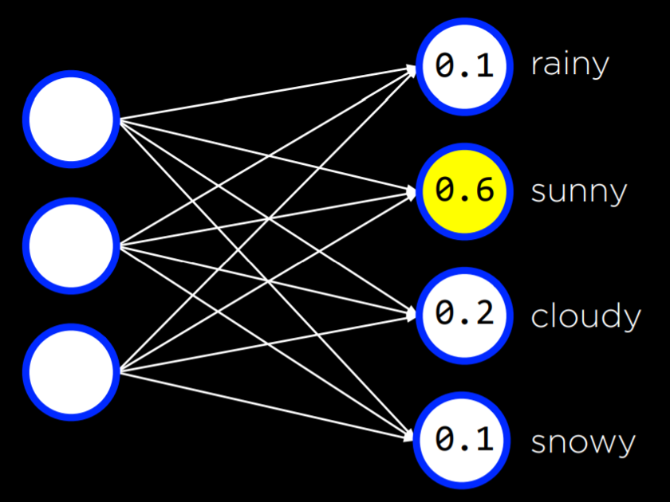

Linear models can only draw straight boundaries, but real-world data often requires **non-linear** models → multilayer networks.

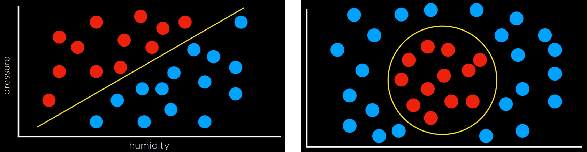

---

## Multilayer Neural Networks

A **multilayer network** has:

* Input layer
* Output layer
* One or more **hidden layers**

Hidden layers allow modeling of complex, non-linear data.

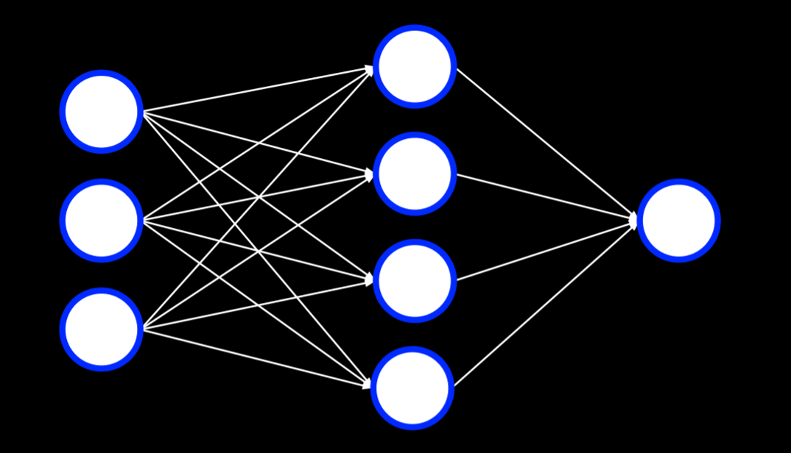

---

## Backpropagation

Training multilayer networks uses **backpropagation**:

* Compute error at output.
* Propagate it backward through layers.
* Update weights via gradient descent.

With many hidden layers, this yields **deep neural networks**.

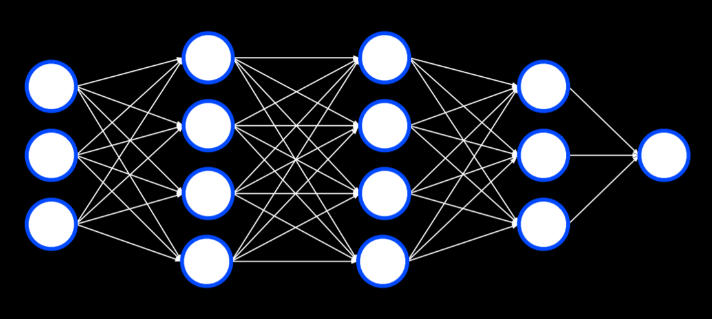

---

## Overfitting

Networks can overfit training data. One solution: **dropout**—randomly deactivate some units during training so the model doesn’t rely too heavily on any one.

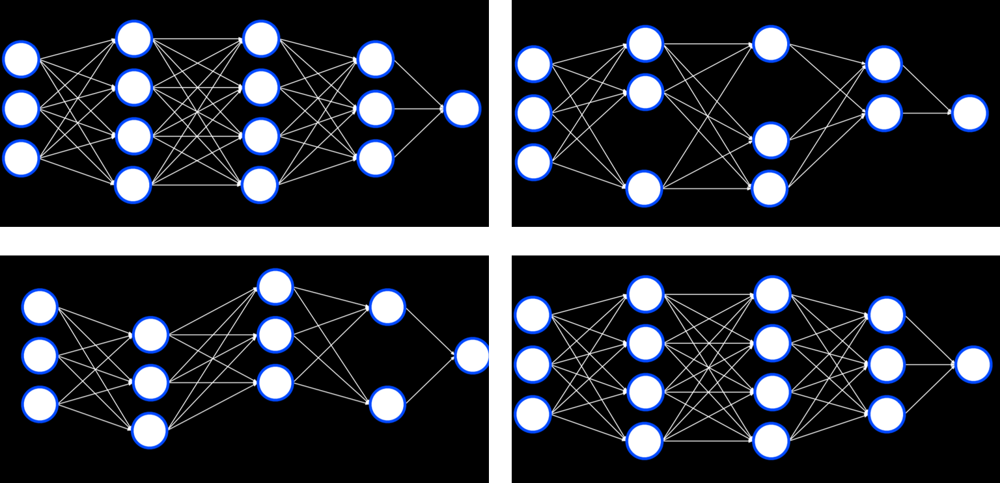

---

## TensorFlow

Libraries like **TensorFlow/Keras** handle the details. Example: counterfeit note detection.

```python
import csv
import tensorflow as tf
from sklearn.model_selection import train_test_split
```

We import TensorFlow and call it tf (to make the code shorter).

```python
# Read data in from file
with open("banknotes.csv") as f:
    reader = csv.reader(f)
    next(reader)

    data = []
    for row in reader:
        data.append({
            "evidence": [float(cell) for cell in row[:4]],
            "label": 1 if row[4] == "0" else 0
        })

# Separate data into training and testing groups
evidence = [row["evidence"] for row in data]
labels = [row["label"] for row in data]
X_training, X_testing, y_training, y_testing = train_test_split(
    evidence, labels, test_size=0.4
)
```
---

## Computer Vision

Neural networks are also used for image analysis (e.g., face recognition, handwriting, self-driving cars). Images are grids of RGB values (0–255). Directly feeding pixels is inefficient, so we use **convolution** to highlight features.

---

## Image Convolution

Convolution applies a **kernel** (filter) to combine each pixel with its neighbors.

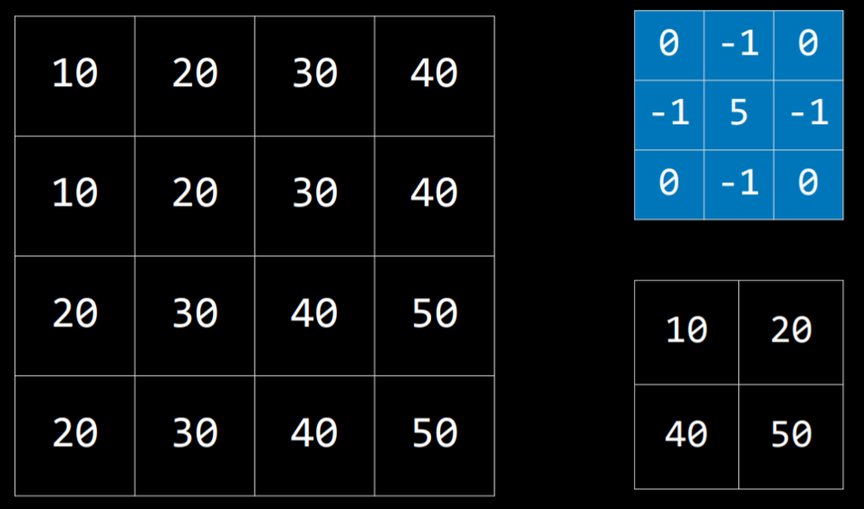

For edge detection, a special kernel emphasizes pixel differences:

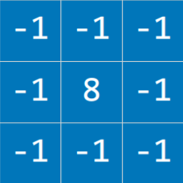


Python implementation with **PIL**:

```python
from PIL import Image, ImageFilter
...
filtered = image.filter(ImageFilter.Kernel(
    size=(3, 3),
    kernel=[-1, -1, -1, -1, 8, -1, -1, -1, -1],
    scale=1
))
```

To reduce inputs, we apply **Pooling** (e.g., Max-Pooling picks the max value in a region).

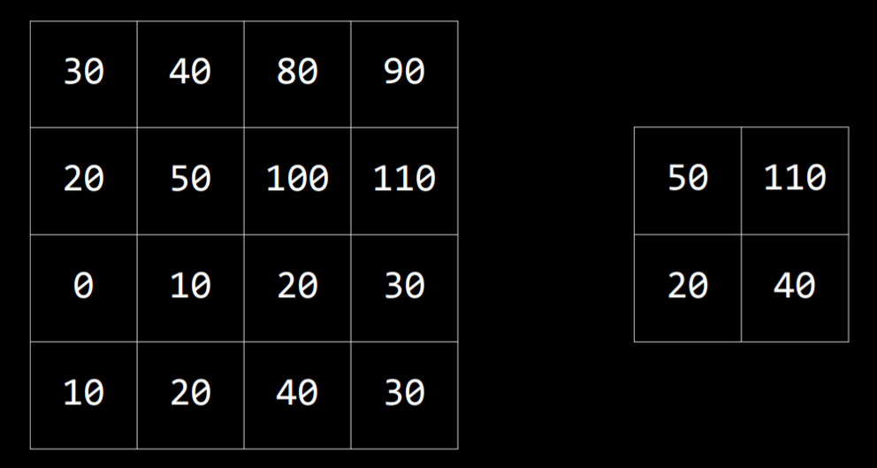

---

## Convolutional Neural Networks (CNNs)

A **CNN** combines convolution + pooling + traditional neural layers.

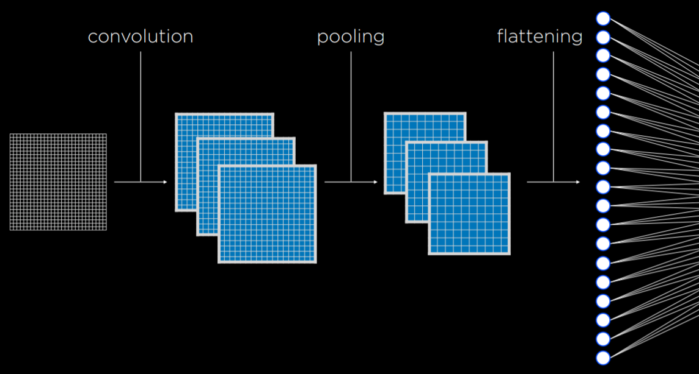

They’re less sensitive to variations (e.g., same object from different angles).

Example: digit recognition with MNIST in TensorFlow.
```
import sys
import tensorflow as tf

# Use MNIST handwriting dataset
mnist = tf.keras.datasets.mnist

# Prepare data for training
(x_train, y_train), (x_test, y_test) = mnist.load_data()
x_train, x_test = x_train / 255.0, x_test / 255.0
y_train = tf.keras.utils.to_categorical(y_train)
y_test = tf.keras.utils.to_categorical(y_test)
x_train = x_train.reshape(
    x_train.shape[0], x_train.shape[1], x_train.shape[2], 1
)
x_test = x_test.reshape(
    x_test.shape[0], x_test.shape[1], x_test.shape[2], 1
)

# Create a convolutional neural network
model = tf.keras.models.Sequential([

    # Convolutional layer. Learn 32 filters using a 3x3 kernel
    tf.keras.layers.Conv2D(
        32, (3, 3), activation="relu", input_shape=(28, 28, 1)
    ),

    # Max-pooling layer, using 2x2 pool size
    tf.keras.layers.MaxPooling2D(pool_size=(2, 2)),

    # Flatten units
    tf.keras.layers.Flatten(),

    # Add a hidden layer with dropout
    tf.keras.layers.Dense(128, activation="relu"),
    tf.keras.layers.Dropout(0.5),

    # Add an output layer with output units for all 10 digits
    tf.keras.layers.Dense(10, activation="softmax")
# Train neural network
model.compile(
    optimizer="adam",
    loss="categorical_crossentropy",
    metrics=["accuracy"]
)
model.fit(x_train, y_train, epochs=10)

# Evaluate neural network performance
model.evaluate(x_test,  y_test, verbose=2)
```
---

## Recurrent Neural Networks (RNNs)

**Feed-forward networks** process input → output once.


**RNNs** feed outputs back into the network, useful for sequences (sentences, video frames, translations).

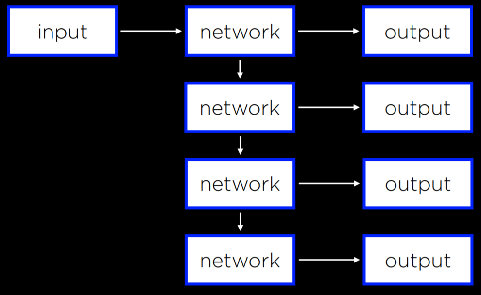
